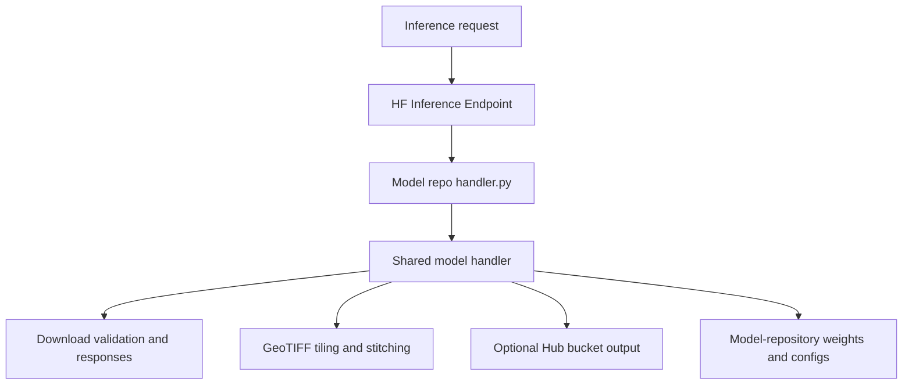

# Geobase Inference

Reusable model handlers and geospatial infrastructure for Hugging Face
Inference Endpoints.



Each model repository keeps its model assets and a small wrapper:

```python
from geobase_inference.models import ChangeStarHandler

class EndpointHandler(ChangeStarHandler):
    pass
```

Install a released integration directly from Git:

```text
geobase-inference[changestar] @ git+https://github.com/decision-labs/geobase-inference.git@v0.1.1
```

Available integrations:

- `ChangeStarHandler`: ONNX building segmentation over tiled GeoTIFFs.
- `ClayHandler`: Clay global or patch embeddings with JSON, GeoArrow,
  Supabase, and optional Hub bucket persistence.

## ChangeStar output CRS

Building GeoJSON is returned in `EPSG:4326` by default. Set `output_crs`
at the top level or inside `parameters` to request another CRS:

```json
{
  "inputs": "https://example.com/image.tif",
  "parameters": {"output_crs": "EPSG:3857"}
}
```

The mask GeoTIFF remains in the source raster CRS.

## Optional Hub bucket output

Handlers return inline JSON unless bucket persistence is configured:

- `HF_TOKEN` or `HUGGING_FACE_HUB_TOKEN`
- `HF_BUCKET=namespace/bucket-name`
- optional `HF_OUTPUT_PREFIX`

Requests may set `use_bucket: false` to force an inline response or
`use_bucket: true` to require configured bucket persistence.

## Development

```bash
uv sync --all-extras
uv run pytest
uv run ruff check .
```
