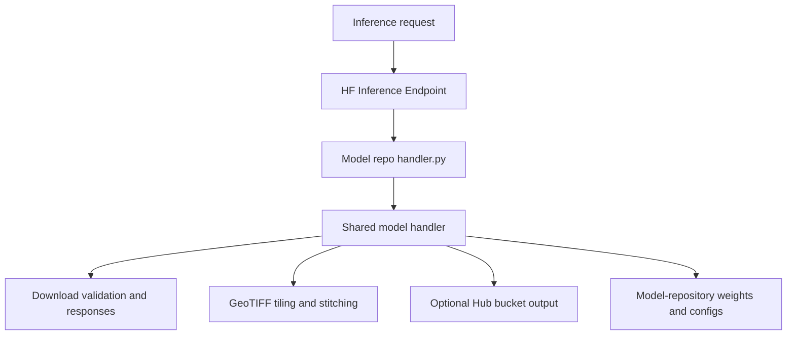

# Geobase Inference

Reusable model handlers and geospatial infrastructure for Hugging Face
Inference Endpoints.



## Model guides

- [ChangeStar](docs/changestar.md): ONNX building segmentation over tiled imagery.
- [Clay](docs/clay.md): global or patch embeddings with JSON or GeoArrow output.

Each guide includes installation, the model repository's `handler.py` wrapper,
request parameters, and response formats.

## Imagery inputs

All handlers accept the original GeoTIFF/COG URL:

```json
{"imagery": "https://example.com/image.tif"}
```

The equivalent typed form is:

```json
{"imagery": {"type": "geotiff", "url": "https://example.com/image.tif"}}
```

ESRI ImageServer input uses an EPSG:4326 GeoJSON polygon. The service is
queried through `exportImage`, and pixels outside the polygon are masked:

```json
{
  "imagery": {
    "type": "esri",
    "url": "https://example.com/arcgis/rest/services/Imagery/ImageServer",
    "polygon": {
      "type": "Polygon",
      "coordinates": [[[-117.60, 47.65], [-117.59, 47.65], [-117.59, 47.66],
        [-117.60, 47.66], [-117.60, 47.65]]]
    },
    "mapParams": {
      "size": [1024, 1024],
      "interpolation": "RSP_BilinearInterpolation",
      "bandIds": [0, 1, 2]
    }
  }
}
```

Supported ESRI `mapParams` are `size`, `interpolation`, `time`, `bandIds`,
`renderingRule`, `mosaicRule`, and `noData`. ESRI exports are normalized to
Web Mercator internally. If `size` is omitted, the ImageServer chooses its
default dimensions. Set `ESRI_TOKEN` as an endpoint secret when the service
requires authentication.

Mapbox input downloads and mosaics raster tiles covering the polygon:

```json
{
  "imagery": {
    "type": "mapbox",
    "polygon": {
      "type": "Polygon",
      "coordinates": [[[-117.60, 47.65], [-117.59, 47.65], [-117.59, 47.66],
        [-117.60, 47.66], [-117.60, 47.65]]]
    },
    "mapParams": {
      "tileset": "mapbox.satellite",
      "zoom": 16,
      "tileSize": 256,
      "imageFormat": "png"
    }
  }
}
```

`zoom` is required. `tileSize` may be `256` or `512` and defaults to the
provider's standard 256-pixel tile. `imageFormat` may be `png`, `png32`,
`jpg70`, `jpg80`, or `jpg90`. Set `MAPBOX_ACCESS_TOKEN` as an endpoint secret.

## Optional Hub bucket output

Handlers return inline JSON unless bucket persistence is configured:

- `HF_TOKEN` or `HUGGING_FACE_HUB_TOKEN`
- `HF_BUCKET=namespace/bucket-name`
- optional `HF_OUTPUT_PREFIX`

Requests may set `use_bucket: false` to force an inline response or
`use_bucket: true` to require configured bucket persistence.

Persisted responses replace inline results with common bucket metadata:

```json
{
  "storage": {
    "provider": "huggingface_hub",
    "bucket": "namespace/bucket-name",
    "keys": ["runs/result.parquet"]
  }
}
```

See the model guides for model-specific persisted artifacts and response fields.

## Development

```bash
uv sync --all-extras
uv run pytest
uv run ruff check .
```
